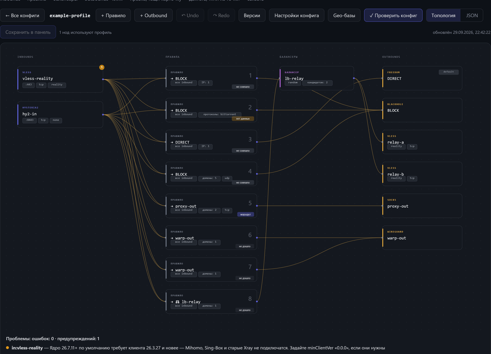
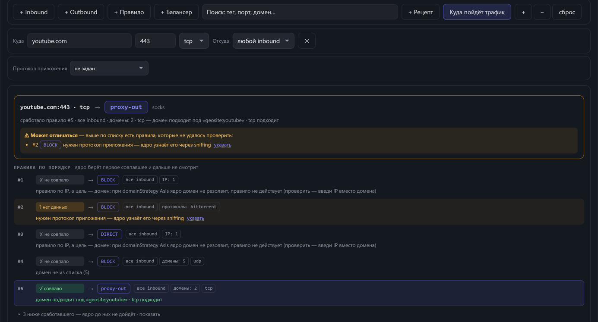

# rwa-plugin-xray-editor

Визуальный редактор Xray-конфигов для [remnawave-admin](https://github.com/Case211/remnawave-admin) (Plugin API v1).
Порт [VAQYBIN/Remnawave-Xray-UI-Editor](https://github.com/VAQYBIN/Remnawave-Xray-UI-Editor) в формат плагина:
ставится одним wheel, живёт внутри админки, пишет конфиги через её родное API.

*English summary — [below](#english).*





*На скриншотах — учебный конфиг с выдуманными тегами и адресами.*

## Что умеет

- **Витрина** — карточки конфиг-профилей панели и шаблонов подписки.
- **Редактор профиля** — граф `inbounds → rules → balancers → outbounds` с формами по протоколам
  (VLESS, VMess, Trojan, Shadowsocks, WireGuard, freedom, blackhole, dns…), визуальный коннектор связей,
  undo/redo, черновик в `localStorage`, диф перед записью, защита от перезаписи чужих правок (`updatedAt`),
  история версий админки со сравнением и откатом в черновик.
- **Линтер целостности** — битые ссылки `outboundTag`/`balancerTag`, Reality поверх ws, `vision` вне tcp,
  ключ SS2022, `leastPing` без observatory, балансер без кандидатов и т.д.
- **Трассировщик** «куда пойдёт трафик» — вводишь домен или IP, порт, tcp/udp (и, если конфиг их различает,
  inbound и протокол приложения) → карточка-вердикт «цель → outbound» с уровнем уверенности, какое правило
  сработало и почему; правила по порядку с человеческими причинами, у «нет данных» — ссылка на нужное поле;
  кнопка «узнать» резолвит IP домена; реальные **geo-базы** (`geosite.dat`, `geoip.dat`) и просмотрщик их категорий.
- **Проверка настоящим ядром** — `xray run -test` приколоченным релизом Xray-core с переводом сообщений ядра на человеческий.
- **Рецепты** — торренты в блокировку, реклама, локальные сети, WARP, цепочка, балансировка: идемпотентное слияние с планом и дифом.
- **Шаблоны** — свои заготовки профилей и галерея [remnawave/templates](https://github.com/remnawave/templates).
- **Шаблоны подписки** панели — XRAY_JSON тем же визуальным редактором, MIHOMO/CLASH/STASH текстом.
- **Инструменты** — пара ключей Reality (x25519 через панель), TLS-проба Reality-цели (TLS 1.3, H2, покрытие SNI).
- **JSON-редактор** на CodeMirror 5 с подсказками по схеме Xray и переносом замечаний линтера на строки.
- Интерфейс на русском и английском (следует языку админки), без сборки: vanilla JS + SVG.

## Требования

| Что | Зачем |
| --- | --- |
| remnawave-admin **≥ 4.5.4** (проверено на 5.1.1) | страница плагина `/plugins/:pluginId` (`PluginUI`, [PR #267](https://github.com/Case211/remnawave-admin/pull/267)) и автоматическая выдача прав плагина суперадмину ([issue #268](https://github.com/Case211/remnawave-admin/issues/268), с 4.5.0) — оба штатные в апстриме; на 4.5.0–4.5.3 остаётся пункт меню и standalone-страница `/api/v2/plugins/xray_editor/ui` |
| Один uvicorn-воркер бэкенда | кэши (галерея, geo-индекс, вендорные файлы) живут в памяти процесса; у админки воркер один по умолчанию |
| Запись в `/app/geoip` (том бэкенда) | geo-базы (~28 МБ) и бинарь Xray-core (~37 МБ) кладутся туда по кнопке; путь меняется переменными `XED_GEO_DIR`, `XED_BIN_DIR` |
| Исходящий HTTPS на `github.com` | галерея шаблонов, geo-базы, Xray-core. Без него редактор работает, этих функций просто не будет |

Python ≥ 3.11; зависимостей сверх тех, что уже есть у бэкенда админки (FastAPI, httpx), нет.

## Установка

1. Скачайте `rwa_plugin_xray_editor-<версия>-py3-none-any.whl` из [Releases](../../releases) и сверьте sha256 из описания релиза.
2. Админка → **Администрирование → Плагины → Загрузить wheel**. Файл ложится в `plugins/`, ставится pip'ом, прочие версии того же пакета удаляются.
3. Перезапустите бэкенд (кнопка там же или `docker restart remnawave-web-backend`), дождитесь в логе `plugins.registered`.
4. В меню появится **«Редактор Xray»**. Суперадмину права выдаются автоматически; остальным ролям — `xray_editor: view` (смотреть, проверять, трассировать) и `xray_editor: edit` (скачивать geo-базы и ядро, править шаблоны подписки).

Ручной путь: положить wheel в `plugins/` и перезапустить бэкенд. Одинаковый номер версии установщик пропускает — старые wheel'ы в `plugins/` не держите.

Конфиг-профили читаются и пишутся через родное `/api/v2/config-profiles` — действуют права `resources: view/edit`
роли, версионирование и аудит админки.

## Что важно знать

> [!IMPORTANT]
> По кнопке **«Проверить ядром → Скачать ядро»** плагин скачивает бинарь **Xray-core** и запускает его
> **внутри контейнера бэкенда админки** (`xray run -test`, только разбор конфига, без прослушивания портов).
> Версия и sha256 архива приколочены в `rwa_xray_editor/xray.py` (`XRAY_VERSION`, `XRAY_SHA256`), архив
> с другой суммой отбрасывается, процессу передаётся минимальное окружение. Если такой запуск в вашей
> модели угроз недопустим — просто не нажимайте кнопку: линтер и трассировщик работают без ядра.

- Geo-базы качаются только с `github.com` / `*.githubusercontent.com` (пресеты v2fly и Loyalsoldier или свой релиз),
  размер ограничен. Держите их теми же, что стоят на нодах, иначе вердикты трассировщика разойдутся с реальностью.
- Проба Reality-цели отклоняет адреса приватных/loopback/link-local диапазонов и соединяется по однажды
  разрешённому IP (защита от DNS-rebinding). Одновременно — не более двух проб и двух проверок ядром.
- Теги инбаундов в панели уникальны **глобально** по всем профилям: при дубликате панель отвечает 409, редактор
  уникализирует теги при создании профиля из шаблона.
- Ошибки внешних сервисов показываются в UI без внутренних URL и путей; подробности — в логе бэкенда (`xray_editor: …`).

## Переменные окружения

| Переменная | По умолчанию | Смысл |
| --- | --- | --- |
| `XED_GEO_DIR` | `/app/geoip` | куда класть `geosite.dat` / `geoip.dat` |
| `XED_BIN_DIR` | `/app/geoip` | куда класть бинарь `xray` |
| `XED_XRAY_VERSION` | `v26.3.27` | тег релиза Xray-core; для версии не из таблицы `XRAY_SHA256` сумма берётся из `.dgst` релиза |

## Разработка

```bash
pip wheel . --no-deps --no-cache-dir -w dist
```

Фронтенд лежит строками в `ui.py`, `codeedit.py`, `schema.py`, `module.py` (CSP админки — `script-src 'self'`, инлайн и CDN не пройдут).
После правок прогоняйте извлечённый JS через парсер (`node --check`), иначе битая строка превращается в молчаливый 404.

Лицензия — [MIT](LICENSE). Атрибуция оригинала и вендорных компонентов — [NOTICE.md](NOTICE.md).

---

## English

Visual Xray config editor as a **remnawave-admin plugin** (Plugin API v1): a port of
[VAQYBIN/Remnawave-Xray-UI-Editor](https://github.com/VAQYBIN/Remnawave-Xray-UI-Editor) that installs as a single wheel
and writes config profiles through the admin panel's own API (RBAC, versioning and audit come for free).

**Features:** topology graph with per-protocol forms, visual connector, undo/redo, local draft, diff before save,
version history; integrity linter; traffic tracer with real `geosite`/`geoip` databases; validation by the real Xray-core
(`xray run -test`); recipes; profile templates and the remnawave/templates gallery; subscription templates; Reality
key pair and target probe; CodeMirror JSON editor with schema hints. UI in Russian and English.

**Requirements:** remnawave-admin ≥ 4.5.4 (tested on 5.1.1; the generic plugin page and automatic superadmin permissions are upstream since 4.5.4 / 4.5.0), single uvicorn worker, writable `/app/geoip` (or `XED_GEO_DIR`/`XED_BIN_DIR`),
outbound HTTPS to github.com for optional downloads.

**Install:** download the wheel from Releases, verify its sha256, upload it via *Administration → Plugins → Upload wheel*,
restart the backend. Grant `xray_editor: view` / `xray_editor: edit` to non-superadmin roles.

> [!IMPORTANT]
> On request, the plugin downloads a **pinned, sha256-verified Xray-core release** and runs `xray run -test`
> **inside the admin backend container** with a minimal environment. If that is unacceptable for you, do not press
> the button — the linter and tracer work without the core.

License: MIT. Third-party attribution: [NOTICE.md](NOTICE.md).
